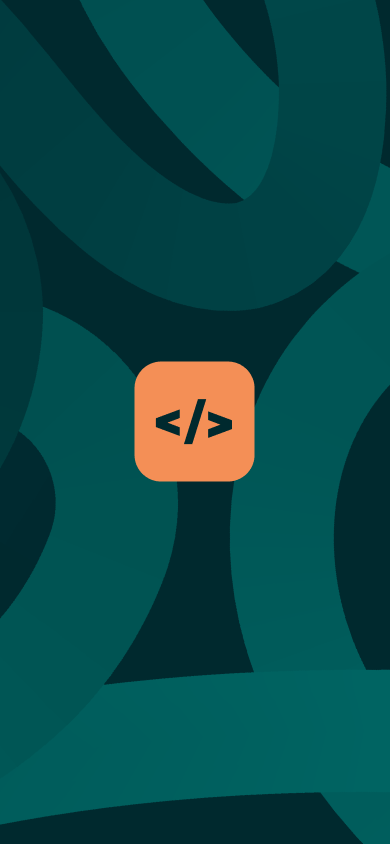
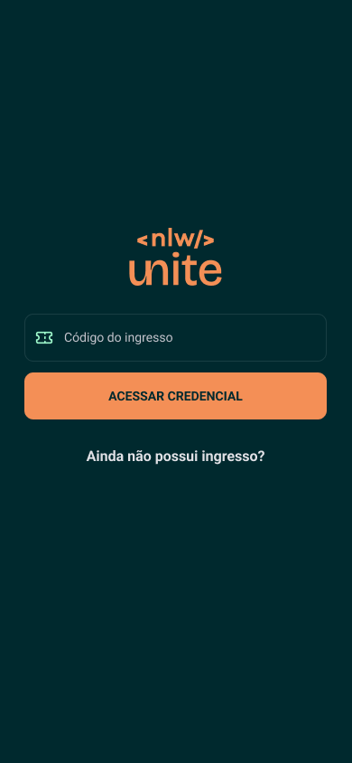
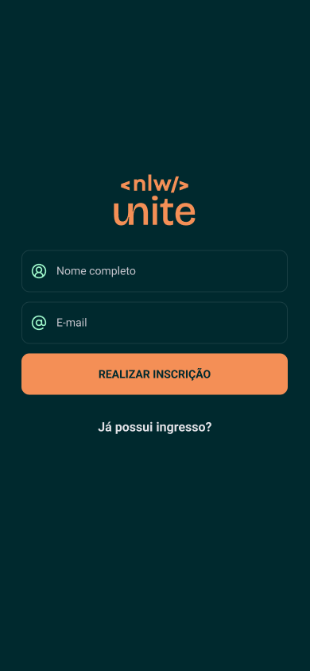
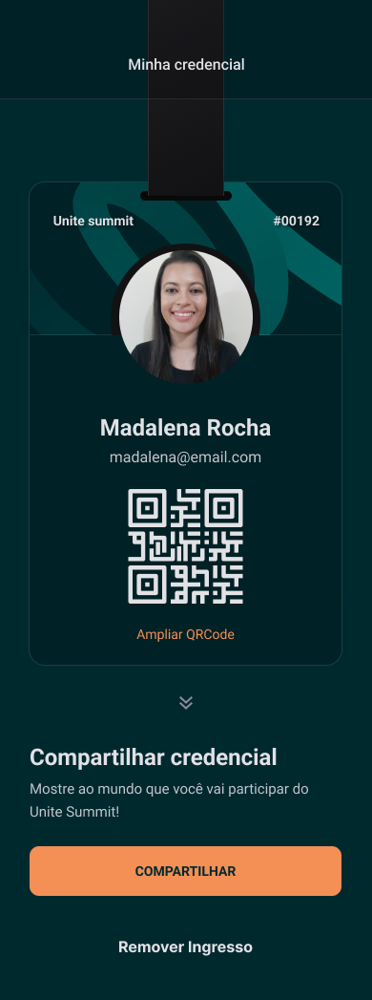

<h1 align="center">pass.in</h1>

> Aplicativo para obter o ingresso de um evento

Projeto desenvolvido na Trilha de React Native da NLW Unite da Rocketseat.

## 💻 Projeto

<div style="display: flex;" align="center">
  
  
  
  
</div>

## 🛠️ Tecnologias

- Expo
- React Native
- React Navigation
- Axios
- Moti
- NativeWind
- ReactJS
- ReactDOM
- Tailwind CSS
- Zustand
- TypeScript

## 💡 Utilização

⚠️ **Importante**: Este projeto utiliza o back-end desenvolvido na Trilha de Node.js da NLW Unite, disponível [aqui](https://github.com/rocketseat-education/nlw-unite-nodejs).

Para instalar a aplicação em sua máquina localmente, clone o projeto, acesse a pasta, instale as dependências e execute a aplicação.

```
$ git clone https://github.com/madalena-rocha/nlw-unite
$ cd nlw-unite
$ npm install
$ npx expo start
```

## 💜 Contato

<div style="display: flex;">
    <a href="https://www.linkedin.com/in/madalena-machado-rocha/" target="_blank"></a>
    <a href="mailto:rochamada1997m@gmail.com"></a>
    <a href="http://discordapp.com/users/827312692905377802" target="_blank"></a>
</div>
